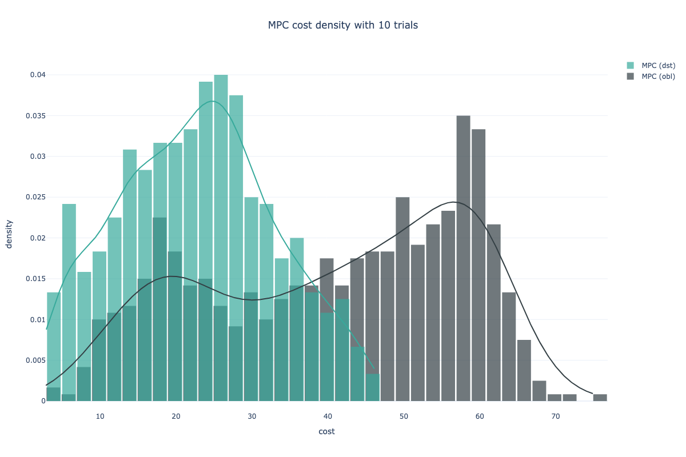

# From Supervised to Reinforcement Learning: an Inverse Optimization Approach

## Installation

To run the provided examples you will need to install [MOSEK](https://docs.mosek.com/10.0/install/installation.html) along with the MOSEK license. MOSEK provides free academic [license](https://www.mosek.com/products/academic-licenses/).

Once the MOSEK installation is completed you can install the required packages and the research package.

```bash
pip install -r requirements.txt
pip install -e .
```
- - -
## Examples

There are several example files included in the `examples/` folder, which you can run:

- `examples/fighter/*` : experiments of Sections 4.1 and B.1 (Appendix)
- `examples/dualheater/*` : experiments of Sections 4.2 and B.2 (Appendix)


Each experiment directory contains jupyter-notebooks for the corresponding experiments. You can visualize the results within the notebooks.
- - -
## Figures

- Figure 1-a
<p float="left">
  
</p>
